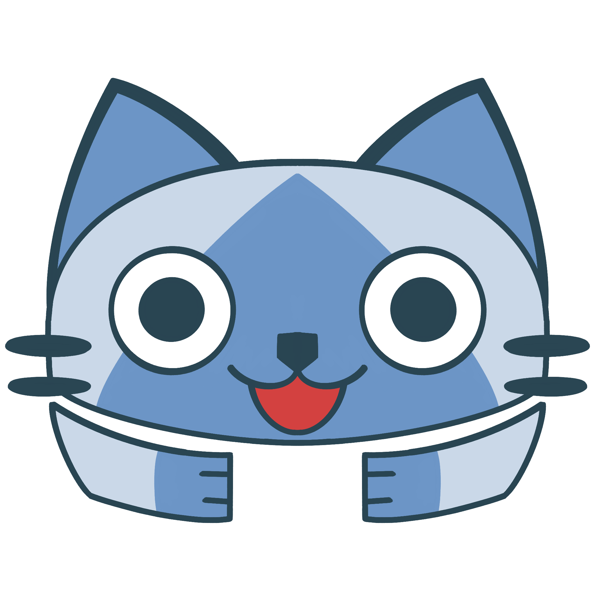

  

 

# 
 Palopedia Discord Bot 
 

This is a fullstack Discord bot project developed using JavaScript and NodeJS based on the Capcom action role-playing game Monster Hunter Wilds. 
Created using the Discord API and DiscordJS Node module inconjunction with the Monster Hunter Wilds database API, this bot is designed to respond to users on the Discord messaging platform. 
The goal of this project is to have a bot respond to user inputs and reply with armor and equipment stats based on the game. 

Discord bot invite link: https://discord.com/oauth2/authorize?client_id=1493775697938878674 

(Note: This bot is currently offline. Currently there are no plans on hosting this bot due to a lack of resources. The purpose of this project is to allow me to learn and hone my skills as a fullstack developer.)

## Features 
/help

/get_armor 

/get_skill 

/get_bonus_skill 

/get_talisman 

/build_loadout

## Installion 

## Attributions 
This project utilizes the "MHWILDS Equipment Icons" and "MHWilds Equipment Skill Icons" from the Monster Hunter Wiki: 
- https://www.monsterhunterwiki.org/wiki/Category:MHWilds_Equipment_Icons 
- https://monsterhunterwiki.org/wiki/Category:MHWilds_Equipment_Skill_Icons
 
Licensed under [CC BY-SA 4.0](https://creativecommons.org/licenses/by-sa/4.0/). 

The icons can be found in the repository unmodified under "./assets/MHWILDS_Icons/...", divided into sub folders. 
